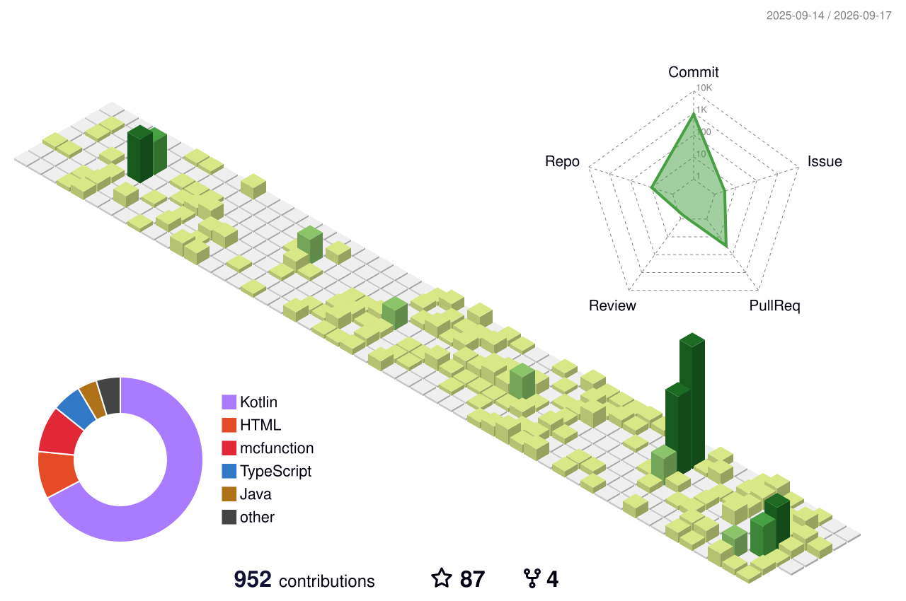

你发现我啦！可以叫我泠雪，或者泠雪狐，或者就叫狐狐也可以（如果这里没有其他狐狐了的话）

My English is not good, so i always feel nervous...｡ﾟ(ﾟ´Д｀ﾟ)ﾟ｡

~~其实就是单纯社恐！~~

在B站是小小UP主，随缘更新，虽然一直想过要不要在Youtube也发点视频但是懒得翻译和上传——就咕咕咕了

高二开始学C和Java，虽然很喜欢编程但是我的专业是——材料学？是的啦，是喜欢化学也喜欢编程的雪狐哦。~~导师在让我看机器学习的东西，说可以用机器学习研究材料学（~~

唔？问我现在在做什么，那就看看我置顶的仓库啦。做mc数据包的，当然最近也在学做独立游戏的说。对了对了，如果你也是写mc命令或者做数据包的，一定记得看看我们的Project MCFPP哦！

还有支持[香草图书馆](https://vanillalibrary.mcfpp.top)谢谢喵！支持[香草前置馆](https://vanillalibrary.mcfpp.top/wheel)谢谢喵！

<a href="https://ghfind.com/u/alumopper?ref=badge">
  <picture>
    <source media="(prefers-color-scheme: dark)" srcset="https://ghfind.com/api/card/mini/alumopper?variant=radar&theme=dark" />
    
  </picture>
</a>

<!-- GitHub Profile 3D Contrib -->
<picture>
  <source media="(prefers-color-scheme: dark)" srcset="./profile-3d-contrib/profile-night-green.svg" />
  <source media="(prefers-color-scheme: light)" srcset="./profile-3d-contrib/profile-green.svg" />
  
</picture>
